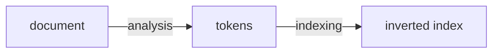
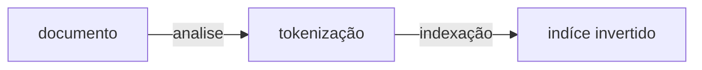
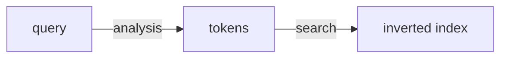
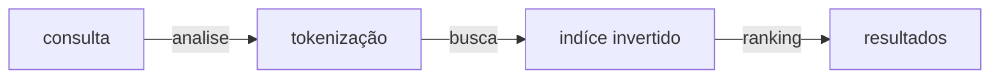
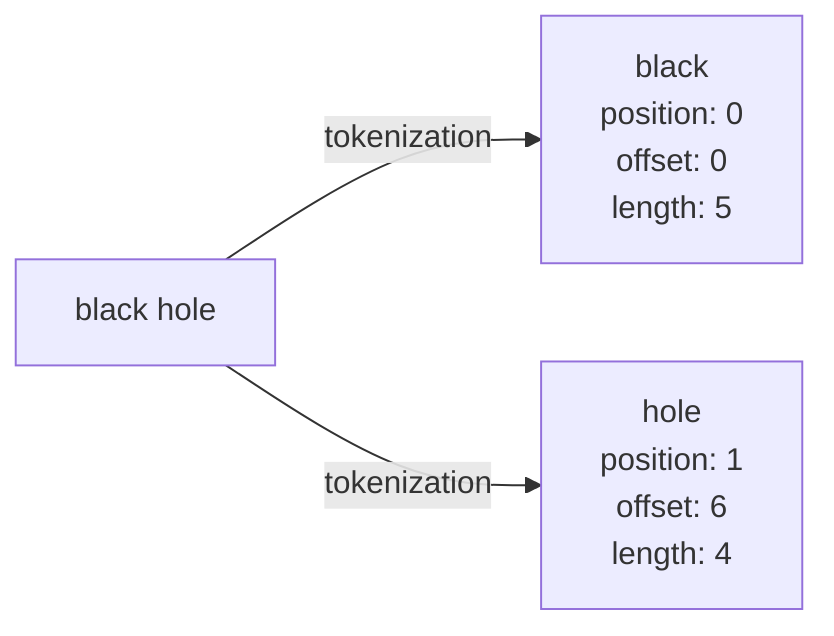
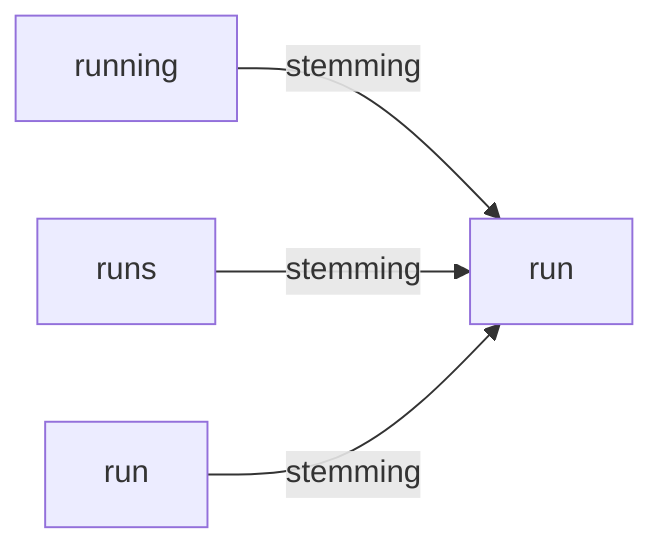
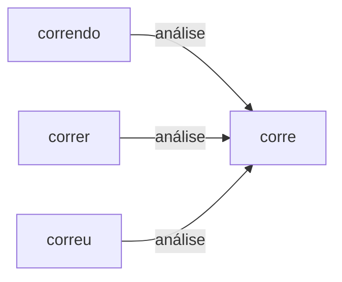
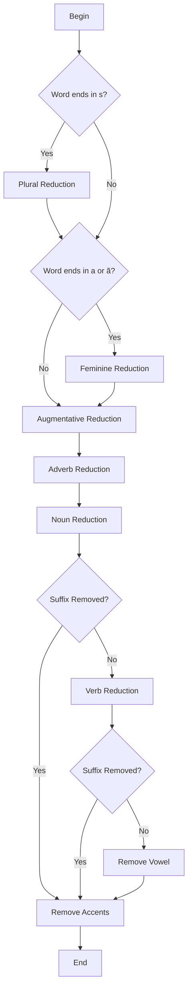

# Apache Lucene Workshop

## What is Lucene?

Lucene is an Information Retrieval system that offers search capabilities to applications. It is a library that can be embedded in applications to provide search capabilities. Lucene is not a standalone application, but a library that can be embedded in applications to provide search capabilities.

## Core

### Inverted index


```js
const a = "I like piza"
const b = "I hate pizza"
const c = "free pizza"

const index = {
  "like" = [a],
  "hate" = [b],
  "free" = [c],
  "I" = [a, b],
  "pizza" = [a, b, c]
}
```

## Basic lucene flow





### Search





#### Example



## Stemming

Stemming is the process of reducing inflected (or sometimes derived) words to their word stem, base or root form—generally a written word form. The stem need not be identical to the morphological root of the word; it is usually sufficient that related words map to the same stem, even if this stem is not in itself a valid root.





#### RSLP (Removedor de Sufixos da Lingua Portuguesa)

